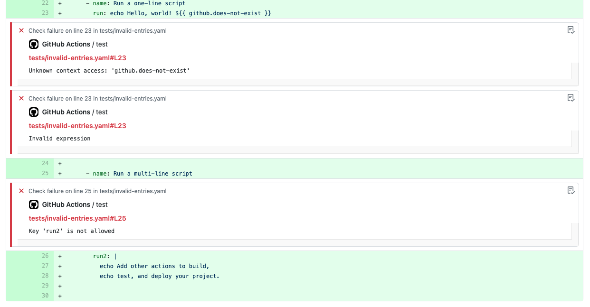

Basic GitHub Actions workflow linter

# Usage

To lint all workflow files

```yaml
name: Lint workflows
on:
  pull_request:
    branches:
      - main
      - 'releases/*'

jobs:
  lint:
    runs-on: ubuntu-latest
    steps:
      - uses: actions/checkout@v2
      - uses: cschleiden/actions-linter@v1
        with:
          workflows: '[".github/workflows/*.yaml"]'
```

# Example



# Future

The underlying [parser](https://www.github.com/cschleiden/github-actions-parser) does support using GitHub's API to dynamically fetch valid runner labels, action parameters etc. in general, but needs more granular control over the API calls made since the `GITHUB_TOKEN` doesn't have all of the required permissions. This functionality might be available in a future version, it's currently disabled 🤞.
